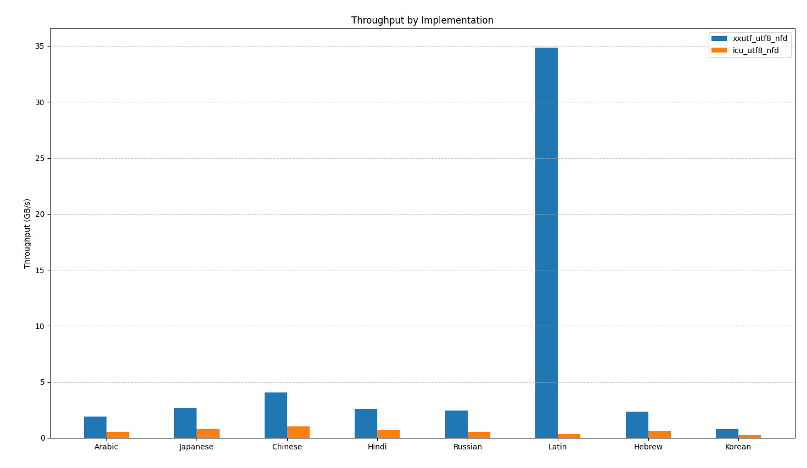

# xxUTF

- [Usage](#usage)
- [API](#api)
- [Streaming](#streaming)
- [Benchmarks](#benchmarks)
- [xxu](#xxu)
- [Building](#building)
- [Fuzzing](#fuzzing)
- [License](#license)

xxUTF is a C library that implements
[Unicode](https://en.wikipedia.org/wiki/Unicode) text transformation algorithms
at speed using SIMD. Current algorithms supported:

- [NFD normalization](https://www.unicode.org/reports/tr15/#Norm_Forms)
- [NFC normalization](https://www.unicode.org/reports/tr15/#Norm_Forms)
- [NFKD normalization](https://www.unicode.org/reports/tr15/#Norm_Forms)
- [NFKC normalization](https://www.unicode.org/reports/tr15/#Norm_Forms)
- [Case folding](https://www.unicode.org/reports/tr21/tr21-5.html)

All algorithms are compatible with UTF-8, UTF-16LE, and UTF-16BE. Further helper
functions are defined for efficient and correct streaming versions of these
algorithms. See the [API](#api) for details.

xxUTF never allocates memory, does not depend on libc, cannot fail, and has the
fastest open source implementations of the listed algorithms available. All
functions are comprehensively tested using both the available Unicode test
suites and a fuzzer.

xxUTF supports Unicode 16.0.0 and below.

## Usage

xxUTF is distributed as a single header, available at the
[release page](https://github.com/dzfrias/xxUTF/releases). This is similar to
what [SQLite does](https://sqlite.org/amalgamation.html).

Example C program:

```c
#include <xxutf.h>
#include <string.h>
#include <stddef.h>
#include <stdio.h>

int main() {
  const char *s = "Ȁ character that needs to be decomposed";
  size_t length = strlen(s);
  printf("Old length: %zu\n", length);
  char out[64];
  size_t out_len = xxutf_normalize_utf8_nfd(s, strlen(s), out);
  printf("New length: %zu\n", out_len);
  return 0;
}
```

One major goal of xxUTF is to have the simplest, most predictable API surface as
possible. As such, one function call usually suffices for the core
functionality. More advanced cases, such as streaming normalization, have a more
involved API. See [Streaming](#streaming) for specifics.

## API

The xxUTF's core API follows this pattern:

```c
/// Normalize the Unicode text bytes in the given normalization form, returning the
/// length of the output. All lengths are measured in bytes. The input is expected
/// to be valid under the specified normalization form.
///
/// It is assumed that the output buffer is large enough to fit the full normalized
/// form of the input. The encoding of the output will match the encoding of the
/// input. Note that, regardless of if the input is encoded in UTF-16 or UTF-8, the
/// input is still a byte pointer. xxUTF does not require the input to be aligned,
/// and the performance difference is marginal even if it is.
size_t xxutf_normalize_ENCODING_FORM(const uint8_t *input, size_t length, uint8_t *out);
/// Get the size of the output buffer needed to normalize the input. The input is
/// expected to be valid under the specified normalization form.
///
/// Note that for NFC and NFKC, the returned size is actually an upper bound
/// calculated from the input, not the exact size. This is the case for speed reasons.
/// All lengths are measured in bytes.
size_t xxutf_normalize_ENCODING_FORM_length(const uint8_t *input, size_t length);

/// Case fold the Unicode text bytes, returning the length of the output. All
/// lengths are measured in bytes. The input is expected to be valid under the
/// specified normalization form.
///
/// It is assumed that the output buffer is large enough to fit the full case folded
/// form of the input. The encoding of the output wil match the encoding of the input.
/// Note that, regardless of if the input is encoded in UTF-16 or UTF-8, the input is
/// still a byte pointer. xxUTF does not require the input to be aligned, and the
/// performance difference is marginal even if it is.
size_t xxutf_casefold_ENCODING(const uint8_t *input, size_t length, uint8_t *out);
/// Get the size of the output buffer needed to case fold the input. All lengths are
/// measured in bytes. The input is expected to be valid under the specified
/// normalization form.
size_t xxutf_casefold_ENCODING_length(const uint8_t *input, size_t length);
```

The valid encodings are:

- `utf8`
- `utf16le`
- `utf16be`

The valid normalization forms are:

- `nfd`
- `nfc`
- `nfkd`
- `nfkc`

For example:

```c
size_t out_length = xxutf_normalize_utf16le_nfkc_length(input, length);
// ...maybe re-allocate according to `out_length`...
(void)xxutf_normalize_utf16le_nfkc(input, length, out);
```

Like many Unicode processing libraries, xxUTF supports a two-pass pattern:

1. Get the expected length of the output without writing.
2. Actually run the algorithm on a properly sized output buffer.

Finding a universal upper bound that depends only on the size of the input is
not hard, but using it is often wasteful. For example, as of Unicode 18.0, the
largest compatibility decomposition (i.e. from NFKD or NFKC) in the
[Basic Multilingual Plane](<https://en.wikipedia.org/wiki/Plane_(Unicode)#Basic_Multilingual_Plane>)
is from the character with code `0xFDFA`. This character is three bytes wide in
UTF-8 pre-decomposition, but expands to an enormous 33 bytes post-decomposition.
The best upper bound for NFKD and NFKC in UTF-8 would thus be some number around
`n * 11` where `n` is the size of the input.

So, unless a lot of prior information is known about the incoming text, use the
length functions to make sure buffer overflows don't happen.

### Streaming

The streaming versions of some Unicode algorithms can usually be implemented
naively (such as with case folding). However, not all algorithms have such nice
properties.

Mainly, normalizing text in a streaming manner requires some care. The problem
is that normalization forms are not closed under string concatenation. In other
words:

```
normalize(x) + normalize(y) = normalize(x + y)
```

**does not** hold for all Unicode strings `x` and `y`. Read the
[Unicode normalization specification](https://www.unicode.org/reports/tr15/#Concatenation)
for more details.

xxUTF thus has special APIs so that streaming normalization can be implemented
in a non-allocating, efficient way. To see these APIs being used to implement
streaming normalization, read the [xxu](/bin/xxu.zig) program source code.

## xxu

xxUTF also provides the `xxu` tool, puts the speed of the xxUTF library onto the
command line. You can download the tool from the
[releases page](https://github.com/dzfrias/xxUTF/releases), or
[build it from source](#building).

Example `xxu` usage:

```
xxu -x casefold file.txt
```

## Benchmarks

xxUTF is benchmarked using a variety of
[large real-world inputs](/benchmarks/inputs) from multiple languages. As there
are many factors to consider during benchmarking, curious users are encouraged
to run the benchmark suite (or write their own benchmarks) on their machines.

These are the results for running NFD normalization on UTF-8 on a machine
supporting
[ARM NEON](<https://en.wikipedia.org/wiki/ARM_architecture_family#Advanced_SIMD_(Neon)>).
Inputs vary in size and complexity, so cross-input comparison is not meaningful
here.



Benchmarks are compared against the
[ICU4C library](https://github.com/unicode-org/icu), as ICU4C has the current
next fastest open soruce implementations of these algorithms.

## Building

xxUTF is built with the [Zig](https://codeberg.org/ziglang/zig) build system,
version 0.15.2.

To build the project in release mode, run `zig build -Doptimize=ReleaseFast`.
The following artifacts will be created:

- `zig-out/lib/libxxutf.a`: a static library defining the xxUTF functions
- `zig-out/include/xxutf.h`: the xxUTF header file
- `zig-out/bin/xxu`: the [`xxu`](#xxu) tool

To create the amalgamation file, run `zig build amalgamate`. It will be put in
`zig-out/amalgamation.c`.

Running the benchmarks is as simple as running `zig build bench`. But note that
ICU4C is required to exist on your system. Make sure that the installed versions
match the Unicode version that xxUTF is built for.

For all available build options, run `zig build --help`.

### Fuzzing

xxUTF is fuzz tested to ensure total safety. To look into the exact fuzzing
setup, see [the relevant README file](test/README.md).

## License

xxUTF is licenced under the [MIT license](/LICENSE.md).
